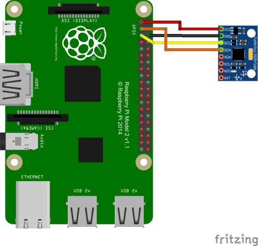

# Bad road detection with a Raspberry Pi

This development is part of my Bachelorthesis. Just a small part of a big concept i wrote.

The idea is to log the GPS Points and the acceleration. With this data it is possible to create a Tableau Map with the bad spots marked.

## Getting started
There is some Hardware which is required to reproduce this project.

### Hardware

* [Raspberry Pi 3 B+](https://www.conrad.de/de/p/raspberry-pi-3-b-1-gb-4-x-1-4-ghz-raspberry-pi-1668026.html) - The core of this project
* [MPU 6050](https://www.invensense.com/products/motion-tracking/6-axis/mpu-6050/) - Six Axis Gyro + Accelerometer Module
* [G-Mouse GPS USB](https://www.amazon.de/USB-GPS-Modul-Navigation-funktioniert-wasserdicht-staubabweisend/dp/B07LBWF1P7/ref=asc_df_B07LBWF1P7/?tag=googshopde-21&linkCode=df0&hvadid=310652715332&hvpos=1o1&hvnetw=g&hvrand=12591051512553471016&hvpone=&hvptwo=&hvqmt=&hvdev=c&hvdvcmdl=&hvlocint=&hvlocphy=9042192&hvtargid=pla-660323231009&psc=1&th=1&psc=1&tag=&ref=&adgrpid=64570534231&hvpone=&hvptwo=&hvadid=310652715332&hvpos=1o1&hvnetw=g&hvrand=12591051512553471016&hvqmt=&hvdev=c&hvdvcmdl=&hvlocint=&hvlocphy=9042192&hvtargid=pla-660323231009) - GPS Module
* Some Jumpercables


### Used packages

* [gps3](https://pypi.org/project/gps3/) - for the GPS Module
* [MPU 6050 Module](https://github.com/lekraft/mpu6050) - for the gyro sensor with a special function to get the specific m/s or g for each axis


## Installing

A step by step series of examples that tell you how to get it running

### 1. Step - Wiring
Wire everything (as you see above and below) and then update



More information about the [MPU6050](https://tutorials-raspberrypi.de/rotation-und-beschleunigung-mit-dem-raspberry-pi-messen/)

```
sudo apt-get update
```


### 2. Step - GPS
Now install everything which is necessary for the GPS module.

Got this tutorial from here: [How can I set up my G-Mouse USB GPS for use with Raspbian?](https://raspberrypi.stackexchange.com/questions/68816/how-can-i-set-up-my-g-mouse-usb-gps-for-use-with-raspbian)

First thing is to make sure the tty port is set to the correct baud rate without Putty involved:
```
stty speed 9600 /dev/ttyACM0
```
Next, install the daemon:

```
sudo aptitude install gpsd gpsd-clients python-gps
```
[GPSD Frequently Asked Questions](http://www.catb.org/gpsd/faq.html)

Invoke the daemon using -nN so it doesn't try to set the baud rate itself:
```
sudo gpsd -nN /dev/ttyACM0 /var/run/gpsd.sock
```
Now run the basic test program to verify gpsd is working
```
cgps -s
```


---> Actually, the first time I ran this I did not get any data. So I had to do this to jump-start it:
```
sudo service gpsd stop
sudo gpsd -nN /dev/ttyACM0 /var/run/gpsd.sock
```

### 3. Step - MPU6050
Now clone the repo which i forked from [Tjindagamer](https://github.com/Tijndagamer/mpu6050)

1. install the python-smbus package
```
sudo apt install python3-smbus
```

2.Clone the repo and run setup.py
```
git clone https://github.com/lekraft/mpu6050.git
cd mpu6050
python setup.py install
```


### 4. Step - Main
Now clone this repository
```
https://github.com/lekraft/badroad_detection.git
```

then run it via
```
python main.py
```

### 5. Step Driving & Logging
Now drive around and log the data. The data will be stored in a JSON file in the folder.

To Stop the program just hit CTRL + C.
Due to this process the JSON file will not be written perfectly. Because of this you have to change the file manually.
1. delete the last entry.
2. Add a ] and a } to the end to close the JSON file.
3. Change file type from .txt to .json

### 6. Analysis
Tableau is a good tool to visualize the data if this is needed.
My Workbench is on [Tableau Public](https://public.tableau.com/views/badroad_detection/Blatt1?:embed=y&:display_count=yes&publish=yes&:origin=viz_share_link), if you are interested you can download the file.

I visualized the points where the acceleration on the x Axis is more than 10 m/s2 (a bit over average 9,81m/s2 in germany)


## Further work
This was just a Proof of Concept for one part of my Bachelorthesis.
